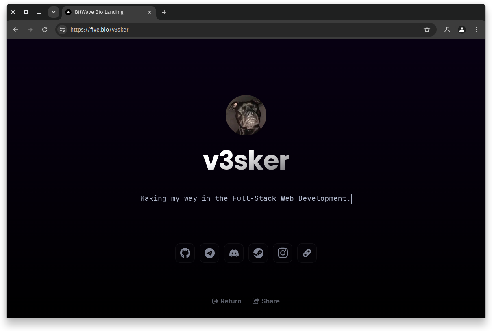

# BitWave Bio

[Russian](./README_RU.md)



BitWave Bio is a web application that generates a custom personal profile bio site
based on a `config.yml` file stored in your user's root GitHub profile repository (where your profile's README.md is stored).<br>
To start using it and share your personal site with your friends, you just need to customize your `config.yml` with needed links,
info, nickname, and much more!

## Installation

**To run your own personal bio site, follow these steps:**

1. Create a `config.yml` file in your profile root repository (in which your README.md is stored)
2. Insert our configuration template inside of that file, and customize it with your info and links
   Template:
   
```
#
#  Configuration file for BitWave Bio
#     https://github.com/BitWaveOrg
#           https://five.bio
#

user_firstname: 'v3sker' # Username shown on profile (Required)
userbio: 'Profesional lazy idiot.' # Profile description (Required)

linkedin_login: 'your_linkedin' # LinkedIn login (Optional)
telegram_login: 'your_telegram' # Telegram login (Optional)
discords_login: 'your_discord' # DiscordS login (Optional)
steam_login: 'your_steam_customid' # SteamCommunity ID (Optional)
instagram_login: 'your_insta' # Instagram login (Optional)
twitch_login: 'your_twitch' # Twitch login (Optional)
facebook_login: 'your_facebook' # Facebook login (Optional)
tiktok_login: 'your_tiktok' # TikTok login (Optional)
youtube_login: 'your_youtube' # YouTube login (Optional)
twitter_login: 'your_twitter' # Twitter login (Optional)
website_url: 'https://your.web.site' # Website url (Optional)
cv_url: 'your_cv_url' # CV URL (Optional)

profile_theme: 'dark' # Profile style
profile_color: 'rgb(0,0,0)' # Profile border color
```

(If you have some problems with configuration file, take a look at [this example](https://github.com/v3sker/v3sker/blob/main/config.yml).)

## Usage

To use BitWave Bio, follow these steps:

1. Create a `config.yml` file in your root GitHub profile repository (use "Instalation" section above.).
2. Define the links and configuration settings in the `config.yml` file.
3. Search your generated personal profile site on [our site](https://bio.bitwavesoftware.tech).
4. Now you can share your personal site with others, just by giving them your unique link!

## Contributing

Contributions are welcome! If you find any bugs or have suggestions for improvement, please open an issue or submit a pull request.
