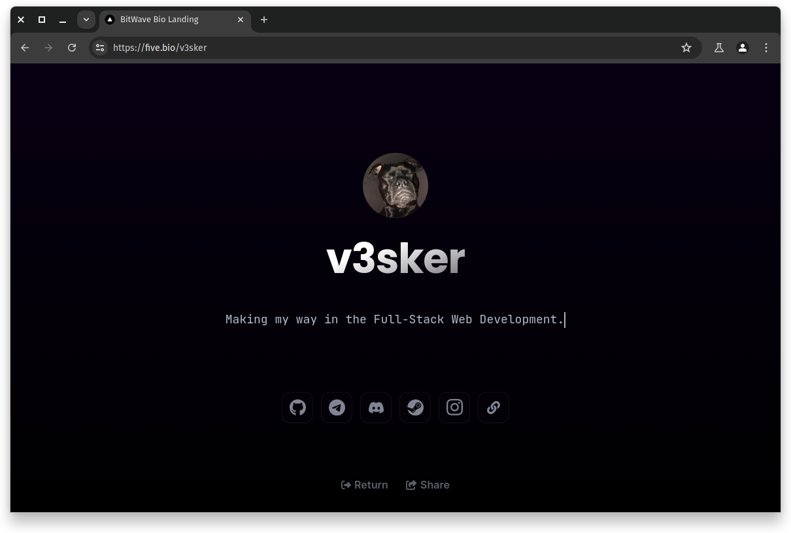

# BitWave Bio

[English](./README.md)



BitWave Bio — это веб-приложение, которое генерирует персональный профиль-блог на основе файла `config.yml`, хранящегося в корневом репозитории вашего профиля GitHub (там, где находится ваш README.md).<br>
Чтобы начать использовать и делиться своим персональным сайтом с друзьями, вам нужно просто настроить ваш `config.yml` с нужными ссылками, информацией, никнеймом и многим другим!

## Установка

**Чтобы запустить свой персональный сайт-блог, выполните следующие шаги:**

1. Создайте файл `config.yml` в корневом репозитории вашего профиля (где хранится ваш README.md).
2. Вставьте наш шаблон конфигурации в этот файл и настройте его под вашу информацию и ссылки.
   Шаблон:

```
#
#  Конфигурационный файл для BitWave Bio
#     https://github.com/BitWaveOrg
#           https://five.bio
#

user_firstname: 'v3sker' # Имя пользователя, отображаемое в профиле (обязательно)
userbio: 'Профессиональный ленивый идиот.' # Описание профиля (обязательно)

linkedin_login: 'your_linkedin' # Логин LinkedIn (опционально)
telegram_login: 'your_telegram' # Логин Telegram (опционально)
discords_login: 'your_discord' # Логин DiscordS (опционально)
steam_login: 'your_steam_customid' # Логин SteamCommunity (опционально)
instagram_login: 'your_insta' # Логин Instagram (опционально)
twitch_login: 'your_twitch' # Логин Twitch (опционально)
facebook_login: 'your_facebook' # Логин Facebook (опционально)
tiktok_login: 'your_tiktok' # Логин TikTok (опционально)
youtube_login: 'your_youtube' # Логин YouTube (опционально)
twitter_login: 'your_twitter' # Логин Twitter (опционально)
website_url: 'https://your.web.site' # URL сайта (опционально)
cv_url: 'your_cv_url' # URL резюме (опционально)

profile_theme: 'dark' # Стиль профиля
profile_color: 'rgb(0,0,0)' # Цвет границы профиля
```

(Если у вас возникли проблемы с файлом конфигурации, посмотрите [этот пример](https://github.com/v3sker/v3sker/blob/main/config.yml).)

## Использование

Чтобы использовать BitWave Bio, выполните следующие шаги:

1. Создайте файл `config.yml` в корневом репозитории вашего профиля на GitHub (см. раздел "Установка" выше).
2. Определите ссылки и настройки конфигурации в файле `config.yml`.
3. Найдите ваш сгенерированный персональный сайт на [нашем сайте](https://five.bio).
4. Теперь вы можете делиться своим персональным сайтом с другими, просто давая им вашу уникальную ссылку!

## Участие

Мы приветствуем участие! Если вы найдете ошибки или у вас есть предложения по улучшению, пожалуйста, откройте проблему или отправьте запрос на добавление изменений.